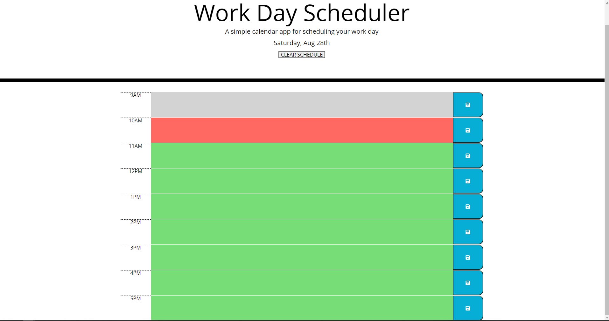

# Third-Party-API

Description: Work day scheduler. Displays day & date, along with timeblocks from 9AM-5PM, and provides area to input & save text. Grey blocks represent the past, red block is the current hour, and green are blocks in the future.

Skills Learned:

- How to use moment() to get current hour, and to display current day/date

- Use javascript to save associated text when  save icon is clicked, and to load saved text on page startup

-  To use Javascript to compare current time, to timeblocks, and color code accordingly

- Using Jquery instead of traditional javascript.

To do:

- Give more unique styling/improve asthetics 

Created using: Javascript, HTML,CSS, and Jquery

Credits:

Jacob Gasper

[Website Link](https://jcgasper.github.io/05-Third-Party-APIs-Work-Day-Scheduler/index.html "Website Link")

[Github Repo](https://github.com/jcgasper/05-Third-Party-APIs-Work-Day-Scheduler "Github Repo")

